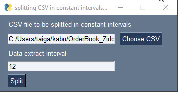

# CSV_Tools

Simple CSV editing tools  
CSVを編集する簡単なツール集です 

## Description

### CSV_Slide_Splitter.ipynb
A tool to split CSV file in constant intervals  
For Example, when lines are 1,2,3,4,5,6 and Data extract interval is 3,  
three csv files which consists of lines 1,4 and 2,5 and 3,6 are generated.  

CSVファイルの行を一定間隔で抽出分割するツールです  
例えば行が1,2,3,4,5,6で，抽出間隔が3のとき，1,4と2,5と3,6の行で構成された3つのcsvファイルが生成されます  

### CSV_Vertical_Merge.ipynb
The tool to vertically merge csv files in specified folder at once  
created csv file will be named as folder name.csv  

指定したフォルダ内に存在するCSVファイルを一括で縦結合するツールです  
フォルダ名.csvとして保存されます  

## Requirement

<b>Required [PySimpleGUI](https://pysimplegui.readthedocs.io/en/latest/)</b> 
$ pip install pysimplegui

## Licence

[MIT](https://github.com/taiga-n/CSV_Tools/blob/master/LICENSE)

## Author

[taiga-n](https://github.com/taiga-n)

